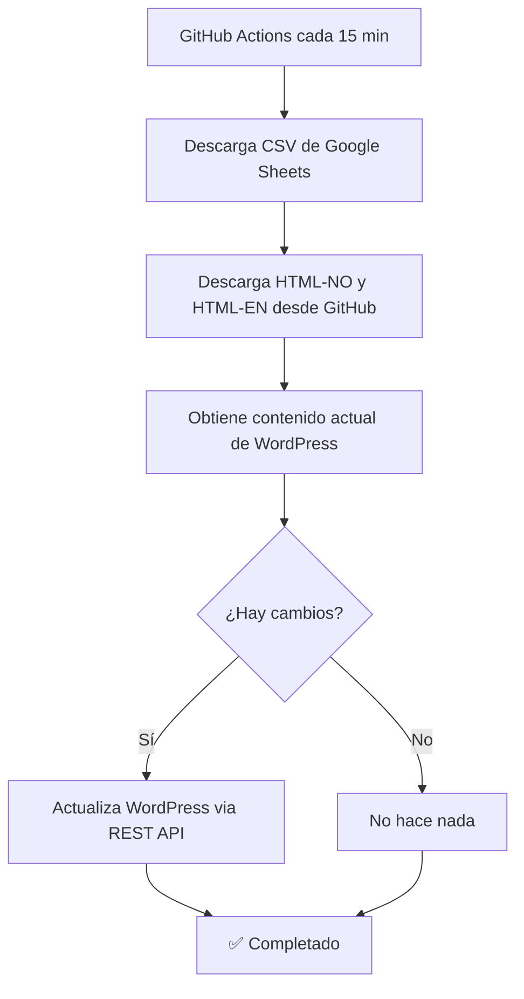

# 🤖 WordPress Automation Setup

Este documento explica cómo configurar la actualización automática de las páginas de WordPress cada 15 minutos.

## 📋 Prerequisitos

1. **WordPress Application Password** creado
2. **GitHub repository** configurado
3. **Acceso a GitHub Secrets** del repositorio

## 🔧 Configuración paso a paso

### 1. Crear GitHub Secret

1. Ve a tu repositorio en GitHub: https://github.com/margaretosoftware/julemenyen
2. Click en **Settings** (⚙️)
3. En el menú lateral, click en **Secrets and variables** → **Actions**
4. Click en **New repository secret**
5. Nombre del secret: `WP_APP_PASSWORD`
6. Valor: `hc8n ogxb 6SVB axZ0 C68J c3FY` (tu Application Password de WordPress)
7. Click en **Add secret**

### 2. Push del código al repositorio

```bash
# Añade todos los archivos nuevos
git add .

# Crea el commit
git commit -m "Add WordPress automation

- Python script to update WordPress pages
- GitHub Actions workflow for automatic updates every 15 minutes
- Documentation for setup

🤖 Generated with [Claude Code](https://claude.com/claude-code)

Co-Authored-By: Claude <noreply@anthropic.com>"

# Push al repositorio
git push
```

### 3. Verificar que funciona

1. Ve a tu repositorio en GitHub
2. Click en la pestaña **Actions**
3. Deberías ver el workflow "Update WordPress Menu"
4. Puedes ejecutarlo manualmente con **Run workflow** para probarlo

## 🔄 Cómo funciona

### Flujo de actualización



### Componentes

1. **update_wordpress.py**: Script Python que:
   - Descarga el CSV de Google Sheets
   - Compara con el contenido actual de WordPress
   - Actualiza si detecta cambios

2. **.github/workflows/update-wordpress.yml**: Workflow que:
   - Se ejecuta cada 15 minutos (`cron: '*/15 * * * *'`)
   - También se puede ejecutar manualmente
   - Usa el secret `WP_APP_PASSWORD` para autenticarse

## 🧪 Probar localmente

Puedes probar el script localmente antes de subirlo:

```bash
# Instala dependencias
pip install requests

# Configura el Application Password
export WP_APP_PASSWORD='hc8n ogxb 6SVB axZ0 C68J c3FY'

# Ejecuta el script
python update_wordpress.py
```

Deberías ver output como:

```
============================================================
🎄 Julemenyen WordPress Auto-Updater
============================================================
📊 Fetching CSV from Google Sheets...
✅ Fetched 15 rows from CSV

============================================================
🇳🇴 Processing Norwegian page...
============================================================
🌐 Fetching NO HTML template from GitHub...
✅ Fetched NO template (25000 chars)
📄 Fetching WordPress page 8498...
✅ Fetched page 8498 (25000 chars)
✅ Norwegian page is already up to date

============================================================
🇬🇧 Processing English page...
============================================================
🌐 Fetching EN HTML template from GitHub...
✅ Fetched EN template (25000 chars)
📄 Fetching WordPress page 8500...
✅ Fetched page 8500 (25000 chars)
✅ English page is already up to date

============================================================
✅ Update process completed successfully
============================================================
```

## 📊 Monitoreo

Para ver el estado de las actualizaciones automáticas:

1. Ve a GitHub → Actions
2. Verás la lista de ejecuciones del workflow
3. Click en cualquiera para ver los logs detallados

### Notificaciones de fallos

Si un workflow falla, GitHub te enviará un email automáticamente.

## 🛠️ Troubleshooting

### Error: "WP_APP_PASSWORD not set"

Asegúrate de que el secret está correctamente configurado en GitHub Settings → Secrets.

### Error: "401 Unauthorized"

El Application Password puede haber expirado o ser incorrecto. Genera uno nuevo en WordPress:
1. WordPress → Users → Profile
2. Scroll down to "Application Passwords"
3. Genera uno nuevo y actualiza el secret en GitHub

### Error: "404 Not Found"

Verifica que los Page IDs (8498 y 8500) son correctos en `update_wordpress.py`.

### El workflow no se ejecuta

GitHub Actions puede tener un delay de hasta 5-10 minutos en workflows scheduled. Si quieres forzar la ejecución:
1. Ve a Actions
2. Selecciona "Update WordPress Menu"
3. Click en "Run workflow"

## 🔐 Seguridad

- **NUNCA** commitees el Application Password directamente en el código
- Usa siempre GitHub Secrets para credenciales sensibles
- El Application Password solo tiene permisos para editar páginas, no acceso completo a WordPress

## 📝 Modificar la frecuencia

Para cambiar la frecuencia de las actualizaciones, edita `.github/workflows/update-wordpress.yml`:

```yaml
schedule:
  # Cada 15 minutos
  - cron: '*/15 * * * *'

  # Cada 30 minutos
  - cron: '*/30 * * * *'

  # Cada hora
  - cron: '0 * * * *'

  # Cada 6 horas
  - cron: '0 */6 * * *'
```

## 🎉 ¡Listo!

Una vez configurado, las páginas de WordPress se actualizarán automáticamente cada 15 minutos si hay cambios en:
- El CSV de Google Sheets
- Los archivos HTML en GitHub (html-no.html, html-en.html)
- El archivo JavaScript (menu.js)

No necesitas hacer nada más. Solo edita el Google Sheets y espera máximo 15 minutos para que se actualice en WordPress. ✨
