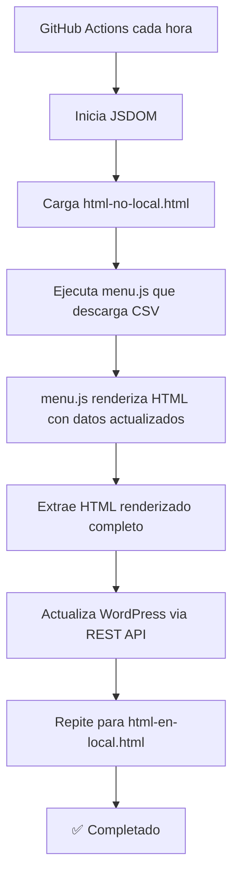

# 🤖 WordPress Automation Setup

Este documento explica cómo configurar la actualización automática de las páginas de WordPress cada hora.

## 📋 Cómo funciona

El sistema usa **JSDOM** (DOM simulation en Node.js) para:

1. Cargar los archivos HTML locales (`html-no-local.html` y `html-en-local.html`)
2. Ejecutar `menu.js` que descarga el CSV de Google Sheets y renderiza todo
3. Extraer el HTML final ya renderizado (con datos actualizados)
4. Subir el contenido actualizado a WordPress **siempre**, sin comparaciones

**Ventaja**:
- Más ligero que Puppeteer (no requiere Chromium)
- Reutiliza toda la lógica de renderizado existente en JavaScript
- Actualiza siempre, asegurando que WordPress tiene la última versión

## 🔧 Configuración paso a paso

### 1. Crear GitHub Secret

1. Ve a tu repositorio: https://github.com/margaretosoftware/julemenyen
2. Click en **Settings** (⚙️)
3. En el menú lateral: **Secrets and variables** → **Actions**
4. Click en **New repository secret**
5. Nombre: `WP_APP_PASSWORD`
6. Valor: `hc8n ogxb 6SVB axZ0 C68J c3FY`
7. Click **Add secret**

### 2. Crear el workflow de GitHub Actions

El workflow ya está creado en `.github/workflows/update-wordpress.yml`, pero como tu token no tiene permisos para crear workflows, necesitas crearlo manualmente:

1. Ve a tu repositorio en GitHub
2. Click en **Actions** → **New workflow** → **set up a workflow yourself**
3. Copia el contenido de `.github/workflows/update-wordpress.yml` del repositorio local
4. Click **Commit changes**

### 3. Push del código

```bash
git add .
git commit -m "Add WordPress automation with Puppeteer

- Node.js script using Puppeteer to render pages with live data
- GitHub Actions workflow running every hour
- Extracts rendered HTML and updates WordPress via REST API

🤖 Generated with [Claude Code](https://claude.com/claude-code)

Co-Authored-By: Claude <noreply@anthropic.com>"

git push
```

### 4. Probar el workflow

1. Ve a GitHub → Actions
2. Selecciona "Update WordPress Menu"
3. Click **Run workflow** para ejecutarlo manualmente
4. Verifica que se ejecuta sin errores

## 🔄 Frecuencia de actualización

El workflow se ejecuta **cada hora** (`cron: '0 * * * *'`).

Si quieres cambiar la frecuencia, edita `.github/workflows/update-wordpress.yml`:

```yaml
schedule:
  # Cada hora (actual)
  - cron: '0 * * * *'

  # Cada 30 minutos
  - cron: '*/30 * * * *'

  # Cada 2 horas
  - cron: '0 */2 * * *'

  # Cada 6 horas
  - cron: '0 */6 * * *'
```

## 🧪 Probar localmente

```bash
# Instala dependencias
npm install

# Configura el Application Password
export WP_APP_PASSWORD='hc8n ogxb 6SVB axZ0 C68J c3FY'

# Ejecuta el script
node update_wordpress.js
```

Output esperado:

```
============================================================
🎄 Julemenyen WordPress Auto-Updater
============================================================

============================================================
🇳🇴 Processing Norwegian page...
============================================================
🌐 Rendering html-no-local.html with Puppeteer...
✅ Rendered html-no-local.html (25000 chars)
📄 Fetching WordPress page 8498...
✅ Fetched page 8498 (25000 chars)
✅ Norwegian page is already up to date

============================================================
🇬🇧 Processing English page...
============================================================
🌐 Rendering html-en-local.html with Puppeteer...
✅ Rendered html-en-local.html (25000 chars)
📄 Fetching WordPress page 8500...
✅ Fetched page 8500 (25000 chars)
✅ English page is already up to date

============================================================
✅ Update process completed successfully
============================================================
```

## 📊 Flujo del sistema



## 🛠️ Troubleshooting

### Error: "WP_APP_PASSWORD not set"
Asegúrate de que el secret está correctamente configurado en GitHub Settings → Secrets.

### Error: "401 Unauthorized"
El Application Password puede haber expirado. Genera uno nuevo en WordPress:
1. WordPress → Users → Profile
2. Scroll down a "Application Passwords"
3. Genera uno nuevo y actualiza el secret en GitHub

### Error: "404 Not Found"
Verifica que los Page IDs (8498 y 8500) son correctos en `update_wordpress.js`.

### JSDOM no renderiza correctamente
Asegúrate de que los archivos `html-no-local.html` y `html-en-local.html` existen y usan `./menu.js` (no la CDN).

### El workflow no se ejecuta
GitHub Actions puede tener un delay de hasta 5-10 minutos. Para forzar ejecución:
1. Ve a Actions
2. Selecciona "Update WordPress Menu"
3. Click "Run workflow"

## 🔐 Seguridad

- **NUNCA** commitees el Application Password directamente en el código
- Usa siempre GitHub Secrets para credenciales sensibles
- El Application Password solo tiene permisos para editar páginas

## 🎉 Resultado final

Una vez configurado:

✅ **GitHub Actions se ejecuta cada hora**
✅ **JSDOM renderiza las páginas con datos actualizados del CSV**
✅ **WordPress se actualiza automáticamente SIEMPRE (sin comparaciones)**
✅ **Tu cliente solo edita Google Sheets**

Los cambios aparecerán en WordPress en máximo 1 hora automáticamente. 🚀
